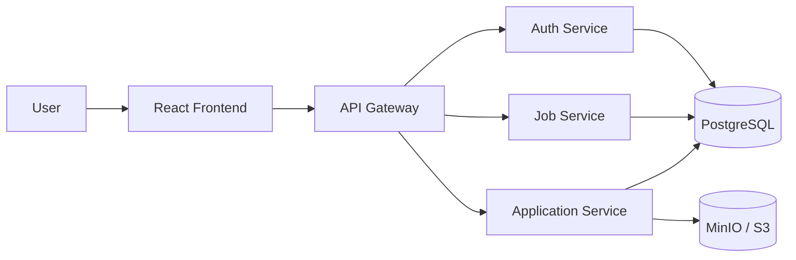

# ApplyHub Source Pipeline

Application source repository used by the ApplyHub DevOps/CI/CD project. The
focus of this repo is not the application domain itself, but the delivery
pipeline around a multi-service codebase: change detection, reusable checks,
Docker image builds, registry publishing and GitOps manifest updates.

## 📚 Table Of Contents

- [✨ Highlights](#highlights)
- [🏗️ Application Architecture](#application-architecture)
- [🧩 Service Context](#service-context)
- [📁 Repository Structure](#repository-structure)
- [🚀 CI/CD Flow](#cicd-flow)
- [⚙️ GitHub Actions Workflows](#github-actions-workflows)
- [🏷️ Image Tagging Strategy](#image-tagging-strategy)
- [🔄 GitOps Handoff](#gitops-handoff)
- [🧪 Quality Gates](#quality-gates)
- [🐳 Docker Build Scope](#docker-build-scope)
- [⚙️ Runtime Configuration](#runtime-configuration)
- [🔗 Related Repositories](#related-repositories)

## ✨ Highlights

- Changed-service detection for targeted PR checks.
- Reusable GitHub Actions workflows for Node.js and Python services.
- Per-service lint, format and test gates.
- Docker Buildx image builds for changed services.
- Docker Hub publishing from CI.
- Development deployments tagged with short commit SHAs.
- Production deployments tagged with explicit release versions.
- Automated updates to the separate GitOps manifests repository.

## 🏗️ Application Architecture

The application is a small multi-service workload used to demonstrate the
pipeline across different runtimes and deployment units.



| Service | Runtime | Port | Role |
| --- | --- | --- | --- |
| `frontend` | React, Vite, TypeScript | 80 in Docker | Web UI |
| `api-gateway` | Node.js, Fastify | 4000 | Routes client requests |
| `auth-service` | Node.js, Express | 4001 | Authentication and token handling |
| `job-service` | Python, FastAPI | 4002 | Job listing and job management |
| `application-service` | Node.js, Fastify | 4003 | Applications and resume/object storage |

The frontend calls the API Gateway. The gateway forwards `/auth`, `/jobs` and
`/applications` traffic to the matching backend service.

## 🧩 Service Context

Main gateway routes:

| Route group | Target service |
| --- | --- |
| `/auth/*` | `auth-service` |
| `/jobs/*` | `job-service` |
| `/applications/*` | `application-service` |

Main app capabilities:

- User registration and login.
- Job browsing and recruiter job management.
- Candidate application submission.
- Resume upload and retrieval.

## 📁 Repository Structure

```text
frontend/                   # React/Vite frontend used for image build
backend/
  api-gateway/              # Node.js Fastify gateway
  auth-service/             # Node.js Express service
  job-service/              # Python FastAPI service
  application-service/      # Node.js Fastify service
.github/workflows/          # CI/CD workflows
```

Each service keeps its own dependencies, scripts, tests and Dockerfile.

## 🚀 CI/CD Flow

```text
Pull request
  -> Detect changed services
  -> Run service-specific checks
  -> Merge to dev
  -> Build changed Docker images
  -> Push images to Docker Hub
  -> Update dev image tags in applyhub-manifests
  -> Argo CD deploys the new images
```

Production uses a manual release workflow:

```text
Release tag input
  -> Resolve changed services for the release
  -> Build release Docker images
  -> Push immutable version tags
  -> Update prod values in applyhub-manifests
  -> Argo CD syncs production
```

## ⚙️ GitHub Actions Workflows

| Workflow | Purpose |
| --- | --- |
| `pr-checks.yaml` | Detects changed services and runs only the required checks |
| `check-node-app.yaml` | Reusable Node.js workflow for install, lint, format check, test and optional build |
| `check-python-service.yaml` | Reusable Python workflow for dependency install, Ruff and Pytest |
| `dev-deploy.yaml` | Builds changed images on `dev`, pushes to Docker Hub and updates dev manifests |
| `prod-deploy.yaml` | Builds release images and updates prod manifests with a release tag |

This keeps validation and deployment scoped to the services affected by a
change instead of rebuilding the entire monorepo every time.

## 🏷️ Image Tagging Strategy

| Environment | Tag format | Purpose |
| --- | --- | --- |
| Development | Short Git commit SHA | Trace each dev deployment back to a source revision |
| Production | Release tag, such as `v0.0.6` | Immutable release deployment and rollback |

Images are published per service:

```text
noseyug/applyhub-frontend
noseyug/applyhub-api-gateway
noseyug/applyhub-auth-service
noseyug/applyhub-job-service
noseyug/applyhub-application-service
```

## 🔄 GitOps Handoff

This repository builds and publishes Docker images. Kubernetes deployment is
handled by the manifests repository.

The deployment workflows update files under:

```text
apps-manifests/env/dev/<service>.yaml
apps-manifests/env/prod/<service>.yaml
```

Argo CD then detects the manifests commit and syncs the target Kubernetes
environment.

## 🧪 Quality Gates

Node.js services use:

```bash
npm run lint
npm run format:check
npm run test
```

The frontend also runs:

```bash
npm run build
```

The Python service uses:

```bash
python -m ruff format --check .
python -m ruff check .
python -m pytest
```

## 🐳 Docker Build Scope

Each deployable service owns a Dockerfile, so CI can build images independently:

| Service | Dockerfile |
| --- | --- |
| `frontend` | `frontend/Dockerfile` |
| `api-gateway` | `backend/api-gateway/Dockerfile` |
| `auth-service` | `backend/auth-service/Dockerfile` |
| `job-service` | `backend/job-service/Dockerfile` |
| `application-service` | `backend/application-service/Dockerfile` |

The frontend uses a multi-stage build: Node builds the Vite app and Nginx
serves the static output.

## ⚙️ Runtime Configuration

Runtime defaults are defined in each service's config module for local
development. Deployment-time values and secrets are managed in the manifests
repository.

Key variables:

| Service | Variables |
| --- | --- |
| Frontend | `VITE_API_URL` |
| API Gateway | `GATEWAY_PORT`, `AUTH_URL`, `JOB_URL`, `APPLICATION_URL` |
| Auth Service | `AUTH_PORT`, `AUTH_DB_*`, `JWT_SECRET` |
| Job Service | `JOB_PORT`, `JOB_DB_*` |
| Application Service | `APPLICATION_PORT`, `APPLICATION_DB_*`, `MINIO_*` |

## 🔗 Related Repositories

| Repository | Purpose |
| --- | --- |
| `https://github.com/applyhub7/applyhub` | Source code, Dockerfiles and CI/CD workflows |
| `https://github.com/applyhub7/applyhub-manifests` | Helm chart, environment values and Argo CD application definitions |
