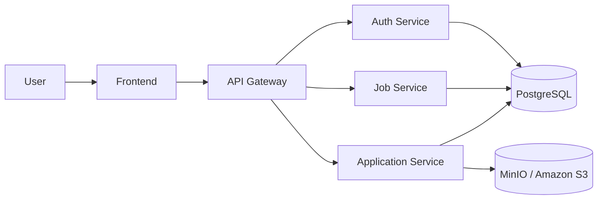
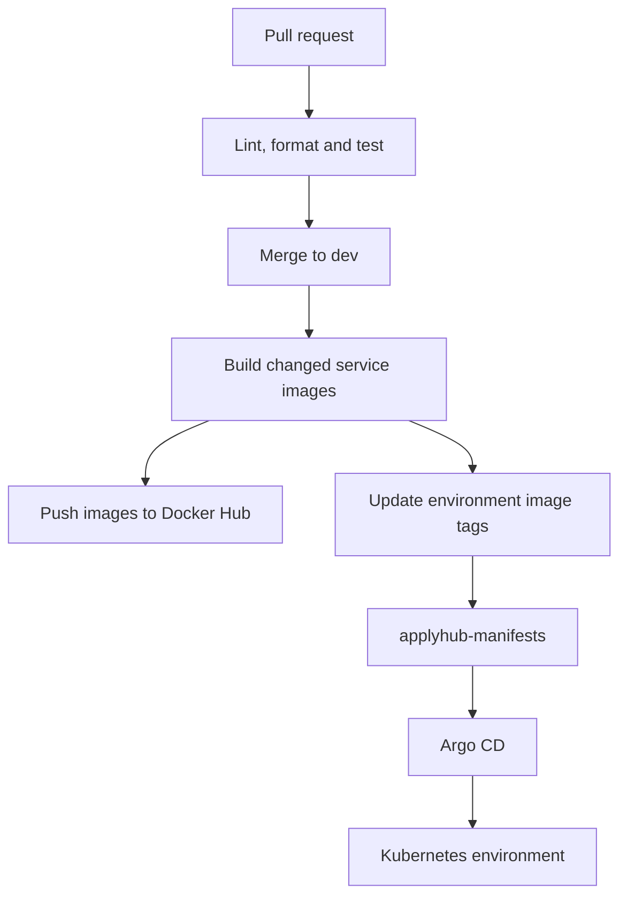

# ApplyHub

ApplyHub is a microservices-based job application platform built as a personal
DevOps/CI-CD portfolio project.

This repository contains the application source code, Dockerfiles and GitHub
Actions workflows. Kubernetes deployment manifests are managed separately in
[applyhub7/applyhub-manifests](https://github.com/applyhub7/applyhub-manifests).


## Overview

ApplyHub simulates a recruitment platform with a frontend, an API gateway and
multiple backend services. The system is structured as a monorepo so each
service can keep its own runtime, dependencies, tests and Docker image.

Main capabilities visible in the source code:

- User authentication flow: register, login, logout, refresh token and verify token.
- Job listing and recruiter-managed job CRUD.
- Job application workflow, including application status and resume retrieval.
- API Gateway routing for `/auth`, `/jobs` and `/applications`.

## Services

| Service | Runtime | Port | Responsibility |
| --- | --- | --- | --- |
| `frontend` | React, Vite, TypeScript | 80 in Docker | Web UI for ApplyHub |
| `backend/api-gateway` | Node.js, Fastify | 4000 | Routes client API requests to backend services |
| `backend/auth-service` | Node.js, Express | 4001 | Authentication and token handling |
| `backend/job-service` | Python, FastAPI | 4002 | Job listing and job management |
| `backend/application-service` | Node.js, Fastify | 4003 | Job applications and resume/object storage integration |

## Architecture



## Tech Stack

| Area | Technologies |
| --- | --- |
| Frontend | React 19, Vite 6, TypeScript |
| Backend | Node.js, Express, Fastify, Python 3.11, FastAPI |
| Data | PostgreSQL, MinIO-compatible object storage |
| Quality | ESLint, Prettier, Ruff, Pytest, Node test scripts |
| Container | Docker, Nginx for frontend static serving |
| CI/CD | GitHub Actions, Docker Buildx, Docker Hub, `yq` manifest updates |

## Repository Structure

```text
frontend/
backend/
  api-gateway/
  auth-service/
  application-service/
  job-service/
.github/
  workflows/
```

Each deployable service has its own `Dockerfile`. Node.js services define their
commands in `package.json`; the Python job service uses `requirements.txt`,
`requirements-dev.txt` and `pyproject.toml`.

## CI/CD

This repository includes five GitHub Actions workflows:

| Workflow | Purpose |
| --- | --- |
| `.github/workflows/pr-checks.yaml` | Detects changed services and runs the required checks for pull requests to `dev` and `main` |
| `.github/workflows/check-node-app.yaml` | Reusable workflow for Node.js services: install, lint, format check, test and optional build |
| `.github/workflows/check-python-service.yaml` | Reusable workflow for the Python service: install dependencies, Ruff checks and Pytest |
| `.github/workflows/dev-deploy.yaml` | Builds changed service images on push to `dev`, pushes them to Docker Hub and updates dev manifests |
| `.github/workflows/prod-deploy.yaml` | Manually deploys a release tag, builds changed images and updates prod manifests |

Deployment follows a GitOps flow:



Development images are tagged with short Git commit SHAs. Production deployment
uses an explicit release tag provided to `prod-deploy.yaml`.

## Notable Implementation Details

- `frontend/Dockerfile` uses a multi-stage build: Node builds the Vite app, then Nginx serves the static files.
- `backend/api-gateway/src/routes.js` centralizes routing to auth, job and application services.
- `backend/auth-service/src/routes.js` exposes the authentication endpoints.
- `backend/job-service/app/routes.py` defines health, job listing, job detail and recruiter-protected job mutation routes.
- `backend/application-service/src/routes.js` handles application actions and resume retrieval.
- CI uses path filtering so a frontend-only change does not need to run every backend service check.

## Related Repository

- Kubernetes manifests: [applyhub7/applyhub-manifests](https://github.com/applyhub7/applyhub-manifests)
